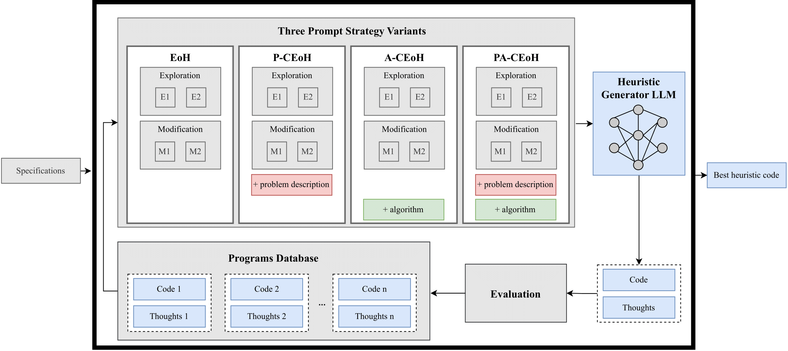
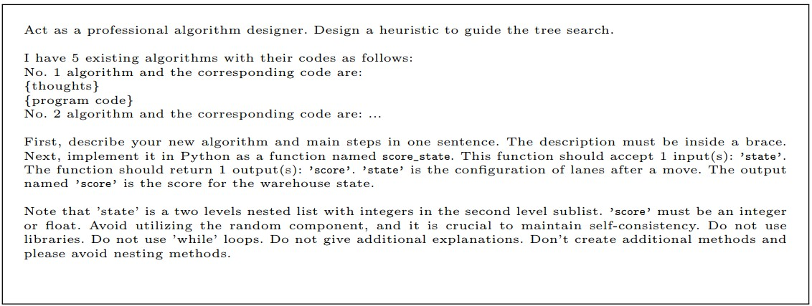
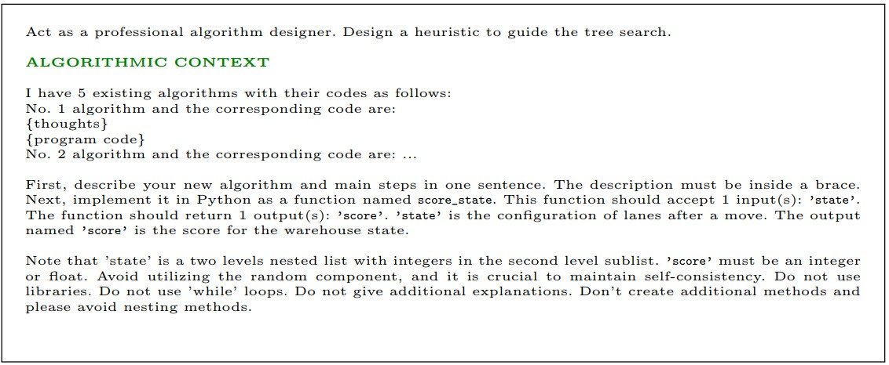
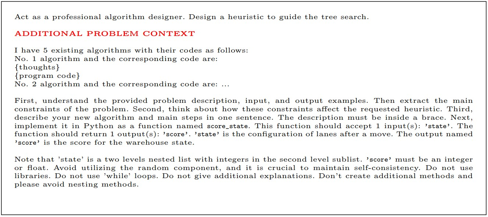
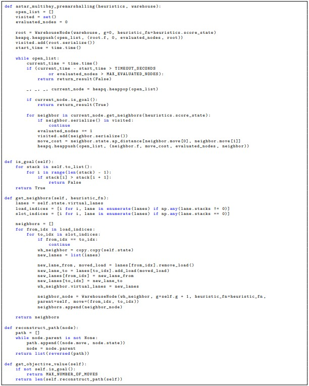
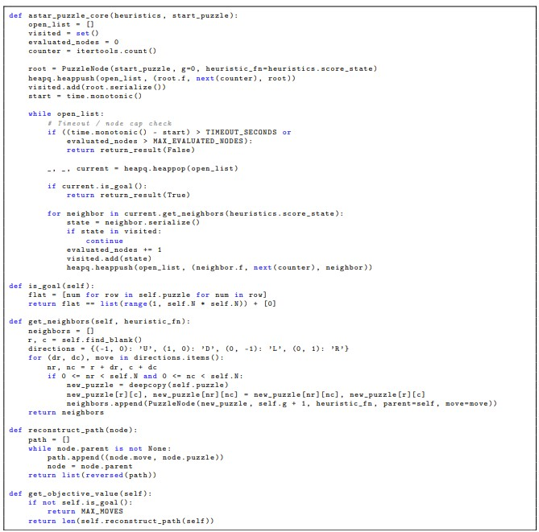
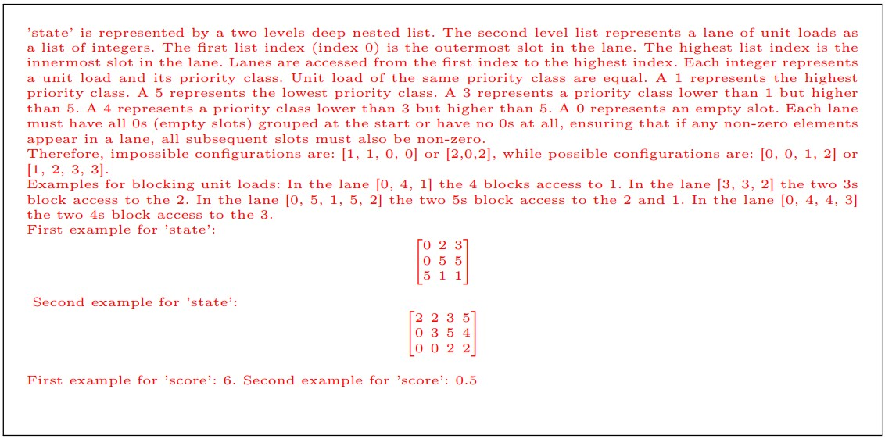
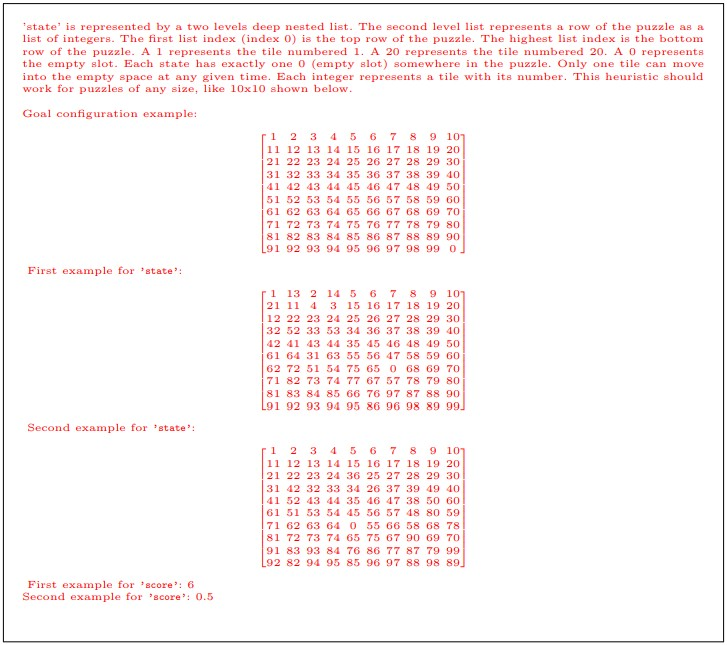

# Algorithmic Prompt-Augmentation for Efficient LLM-Based Heuristic Design for A* Search

This repository contains the codebase for the paper "Algorithmic Prompt-Augmentation for Efficient LLM-Based Heuristic Design for A* Search".

It implements and evaluates two prompt-augmented frameworks — Contextual Evolution of Heuristics (CEoH) and Literature-Based CEoH (LitCEoH) — for automatically generating constructive heuristics using large language models (LLMs). The focus is on the Unit-load Pre-marshalling Problem (UPMP), a complex, niche combinatorial optimization task in warehouse logistics.

The repository includes:
- Full source code for heuristic evolution experiments
- Prompt templates and configuration files
- Benchmarking instances 

Please refer to the paper for methodological details.

This work builds on the **Evolution of Heuristics ([EoH](https://arxiv.org/abs/2401.02051))** framework, an evolutionary method that leverages large language models (LLMs) to generate heuristics for combinatorial optimization problems.

The main contributions of this project are:
- **Algorithmic - Contextual Evolution of Heuristics (A-CEoH)**: 
A-CEoH extends the EoH prompt strategies with algorithmic insights to boot the performance of the generated heuristics.
- **New Application Domain:** 
Demonstrates the potential of LLM-based automated heuristic design to evolve A* guiding heuristics for both a niche optimization problem (UPMP) and a well-studied optimization problem (SPP).
- **Performance Boost for Small Models:**
Shows that combining problem-specific context with algorithmic context enables small, locally deployed LLMs to outperform large, general-purpose LLMs.
- **Outperforming Hand-Crafted Heuristics:** 
Demonstrates that the LLM-generated heuristics surpass established hand-crafted heuristics from the literature for the target instance configurations.

<p float="center">
  
</p>

## **Running the Project**  

- Please run the setup.sh first. It will setup the workspace and extract needed files.__
- Go into the .env file and add your paths. 
- Install dotenv.
- Configure the problem, model, and the prompt augmentation startegy in run_experiments.py.
- Start run_experiments.py


## **Prompt Engineering**


### **EoH vs P-CEoH vs A-CEOH Prompts**
The following figures provide a direct comparison between the prompt templates used in the original **Evolution of Heuristics (EoH)** framework, our **Alogirthmic - Contextual Evolution of Heuristics (A-CEoH)** prompt and the adapted **Problem - Contextual Evolution of Heuristics (P-CEoH)** prompt.


#### **E2 Exploration Prompt Strategy Template**

<p float="center">
  
  
  
</p>

*Figure: Comparison of E1 prompt templates for the UPMP. Left: EoH. Middle: A-CEoH. Right: P-CEoH.*


### **Algorithmic Prompt Augmentation**

<p float="center">
  
  
</p>

*Figure: Algorithmic context. Left: UPMP A-CEoH context. Right: SPP A-CEoH context.*

### **Problem Context Prompt Augmentation**

<p float="center">
  
  
</p>

# **Best Generated Heuristics**

# **UPMP: Qwen2.5-Coder:32b PA-CEoH Heuristic**
```python 
"""
This heuristic calculates the score by assigning penalties for each blocked load based on its priority class, considers the number of empty slots at the beginning of lanes, and adds a penalty for the maximum depth of out-of-order pairs within each lane."""
def score_state(state):
    score = 0
    
    for lane in state:
        max_priority_seen = 5
        blocked_count = 0
        empty_slot_penalty = sum(1 for x in lane if x == 0) * 0.2
        out_of_order_max_depth = 0
        
        for i in range(len(lane) - 1, -1, -1):
            load = lane[i]
            if load == 0:
                continue
            if load > max_priority_seen:
                blocked_count += 1
                for j in range(i):
                    if lane[j] != 0 and lane[j] < load:
                        out_of_order_max_depth = max(out_of_order_max_depth, i - j)
            else:
                max_priority_seen = min(max_priority_seen, load)
        
        score += blocked_count * 1.5 + empty_slot_penalty + out_of_order_max_depth * 0.6
    
    return score
```

# **UPMP: GPT4o:2024-08-06 PA-CEoH Heuristic**
```python 
"""
The new algorithm calculates the heuristic score by applying a penalty for each blocking load, adds a reward by subtracting the total number of consecutive correctly ordered loads, and incorporates a multiplier based on the inverse of the load's priority.
"""
def score_state(state):
    score = 0
    
    for lane in state:
        penalties = 0
        reward = 0
        last_priority = float('inf')
        ordered_count = 0

        for i, load in enumerate(lane):
            if load == 0:
                continue

            if any(lane[j] < load for j in range(i + 1, len(lane))):
                penalties += (1 / load)  # Penalty based on load's priority
                ordered_count = 0
            else:
                ordered_count += 1
                last_priority = load

        reward = ordered_count
        score += penalties - reward

    return score
```


# **SPP: Qwen2.5-Coder:32b A-CEoH Heuristic**
```python 
"""
This heuristic calculates the sum of Manhattan distances for each tile to its target position, adjusted by a penalty based on the cumulative distance of all blocking tiles that are between the current tile and its goal position, with penalties scaled by the proximity of these blocking tiles to the goal.
"""

def score_state(state):
    N = len(state)
    score = 0
    target_positions = {num: divmod(num - 1, N) for num in range(1, N * N)}
    
    for i in range(N):
        for j in range(N):
            tile = state[i][j]
            if tile != 0:
                target_i, target_j = target_positions[tile]
                manhattan_distance = abs(i - target_i) + abs(j - target_j)
                score += manhattan_distance
                
                # Check horizontal blocking tiles
                for k in range(min(j, target_j), max(j, target_j) + 1):
                    if k != j and state[i][k] != 0:
                        other_target_i, other_target_j = target_positions[state[i][k]]
                        if (other_target_i == i and 
                            ((target_j < j and other_target_j > target_j) or 
                             (target_j > j and other_target_j < target_j))):
                            blocking_distance = abs(other_target_j - target_j)
                            score += blocking_distance * (1 + (N - min(target_j, other_target_j)) / N)
                
                # Check vertical blocking tiles
                for k in range(min(i, target_i), max(i, target_i) + 1):
                    if k != i and state[k][j] != 0:
                        other_target_i, other_target_j = target_positions[state[k][j]]
                        if (other_target_j == j and 
                            ((target_i < i and other_target_i > target_i) or 
                             (target_i > i and other_target_i < target_i))):
                            blocking_distance = abs(other_target_i - target_i)
                            score += blocking_distance * (1 + (N - min(target_i, other_target_i)) / N)
    
    return score
```